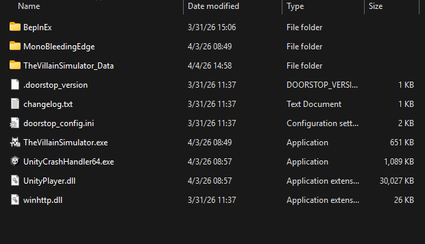

# Getting Started Using Mods

Welcome! This guide will help you understand the basics of adding mods to your TVS installation, and their management thereafter.

There are two well-supported routes for adding and managing TVS mods:

- Manually managing BepInEx packages within the filesystem
- [Thunderstore](https://thunderstore.io/)

This guide will focus exclusively on manual file management for the moment, until Thunderstore/TVS support is better tested and understood.

## How do TVS mods work?

Game modifications can apply their changes in a great number of different ways.

Fortunately, for games built on the Unity game engine such as TVS there exist a wide variety of tools to apply changes to a game in a non-destructive fashion without changing the game's files.

[BepInEx](https://docs.bepinex.dev/index.html) is a popular modding framework which packages a lot of these tools together. It loads compiled code generated by mod developers and provides a great number of ways for developers to either "hook into" or override the code which already exists within the game.

## Setting up TVS for mods

Enabling mod support in TVS is a simple matter of installing BepInEx into the game's installation root.

The [BepInEx documentation](https://docs.bepinex.dev/articles/user_guide/installation/index.html)
covers the steps and considerations in more detail, but in short:

1. Head to the BepInEx Releases page, and find the most recent post for BepInEx 5
    - `BepInEx 5.4.23.5` at time of writing.
2. Download the Zip archive appropriate for your system
    - This will be  `BepInEx_win_x64_5.x.xx.x.zip` for most users.
3. Unzip the archive directly into your game's installation root (or manually transfer the contents there).

When you are done, your game's installation root should look similar to this:

That's it - your game is ready to load BepInEx mods!

> ***TODO:*** check if flipping on the "HideBepInEx" setting is compulsory.

## Installing Mods

Most mods will be provided as a Zip archive, and organized such that the archive's contents should be extracted directly into the game's installation root.

Usually the contents consist solely of a `BepInEx` directory, with the mod's files arranged in subdirectories. Once the mod's `BepInEx` directory is placed inside the game's installation root with the `BepInEx` directory you created when you installed the framework, the two folders and their contents are merged, placing everything precisely where it needs to be.

The mod should be automatically loaded into the game the next time you run it.

### Where does the mod actually live?

Simple mods may consist of a single `{mod ID}.dll` within the `BepInEx/plugins` directory. More complex mods will group all of their functional files and assets in their own subdirectory of that folder.

Mods which apply much larger, sweeping changes to the way in which the game functions may also have files in `BepInEx/patchers`.

## Configuring Mods

If your mod can be configured to change settings and options, it may have come with a default configuration file in `BepInEx/config` that you may edit with a text or code editor.

Sometimes the game must be booted with the mod installed in order for the mod to generate a configuration file there.

A much easier method to managing your mods' configurations and settings is to install the [**BepInEx.ConfigurationManager**](https://github.com/BepInEx/BepInEx.ConfigurationManager#plugin--mod-configuration-manager-for-bepinex) mod, which will provide a basic UI for managing mod settings directly in-game.

---

*Have suggestions for this guide? [Share feedback on GitHub](https://github.com/fealyx/tvs/issues)*
